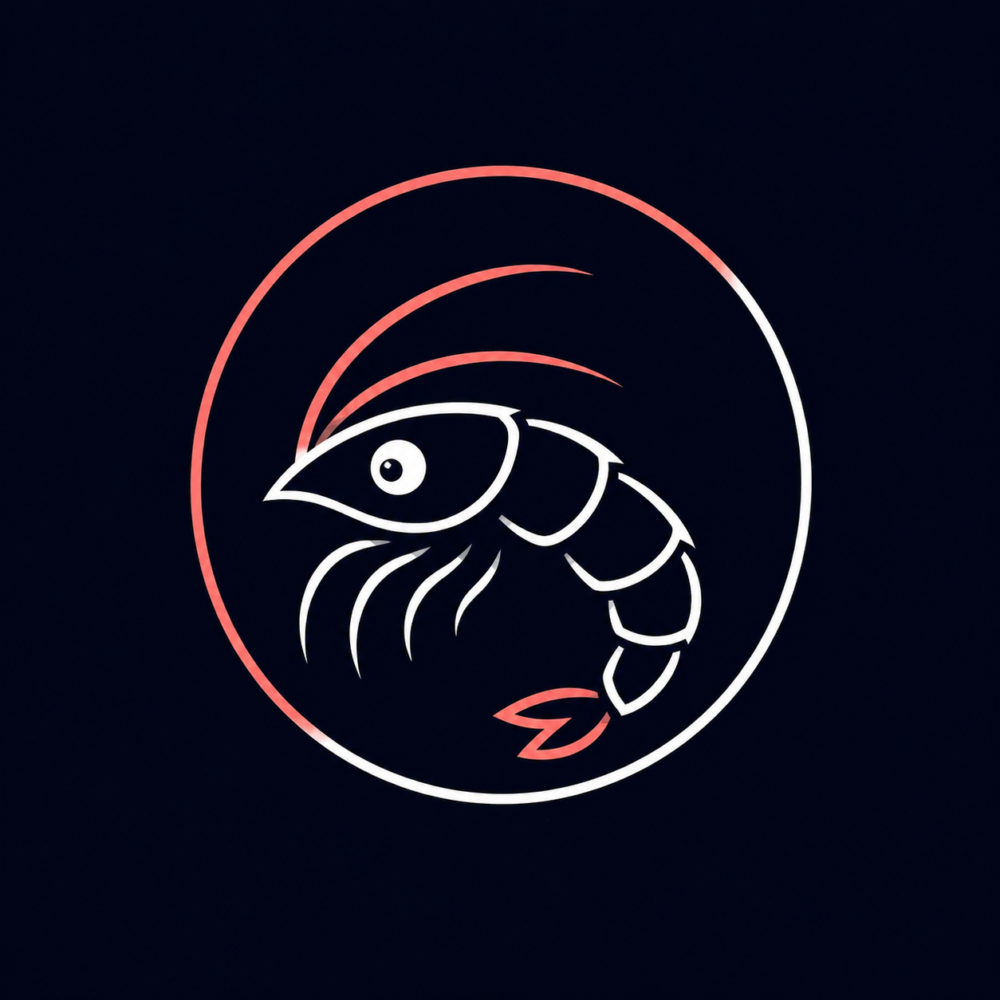

<div align="center">



# Mini Krill

### Your Crustaceous AI Buddy

**A lightweight, open-source AI agent that runs locally or through subscription-backed CLIs. Thinks, plans, and acts — with personality.**

Built by [Sourav Singh](https://souravailabs.ai/about/) / [Sourav AI Labs](https://souravailabs.ai)

[](https://github.com/srvsngh99/mini-krill/releases)
[](https://go.dev/)
[](LICENSE)
[]()

</div>

---

## Why Mini Krill?

Most AI agents need API keys, cloud accounts, or complex setup before you can use them. Mini Krill takes a different approach: **start local, stay private, upgrade when you want to.**

- Run entirely on your machine with [Ollama](https://ollama.com) — no cloud account needed
- Switch to ChatGPT (via Codex CLI) or Claude (via Claude Code CLI) using your existing subscription
- Every action goes through a **plan-before-execute** loop — the agent shows its plan and waits for your approval before acting
- Chat from anywhere — **Telegram bot, terminal CLI, TUI dashboard, or Discord bot** — with shared memory across all interfaces
- Runs on **Windows, Linux, and macOS** — single binary; local inference uses Ollama
- Your data, your machine, your rules

---

## Quick Start

```bash
# Install
curl -fsSL https://raw.githubusercontent.com/srvsngh99/mini-krill/main/scripts/install.sh | bash

# Setup
minikrill init

# Chat
minikrill chat
```

That's it. The init wizard walks you through choosing a provider (Ollama, Codex, or Claude Code).

---

## Features

| Feature | Description |
|---------|-------------|
| **Local-first** | Runs via Ollama with no cloud dependency |
| **Subscription optional** | Switch to Codex or Claude Code through their official CLIs |
| **Plan-before-execute** | Shows its plan, waits for approval before acting |
| **Personality** | Not a boring assistant — a crustaceous AI buddy with soul |
| **Plugin system** | YAML-based skill registry for extensible capabilities |
| **Unified memory** | Move between CLI, TUI, Telegram, and Discord with shared continuity |
| **Chat bots** | Built-in Telegram and Discord bot support |
| **TUI dashboard** | Ocean-themed terminal UI with real-time status |
| **Persistent brain** | Remembers context and conversations across sessions |
| **Health monitoring** | Heartbeat, doctor diagnostics, and sonar pings |
| **Cross-platform** | Linux, macOS, and Windows — single ~15MB binary |

---

## Installation

### One-liner (Linux / macOS)

```bash
curl -fsSL https://raw.githubusercontent.com/srvsngh99/mini-krill/main/scripts/install.sh | bash
```

### Windows

```powershell
irm https://raw.githubusercontent.com/srvsngh99/mini-krill/main/scripts/install.ps1 | iex
```

### Go Install

```bash
go install github.com/srvsngh99/mini-krill/cmd/minikrill@latest
```

### Docker

```bash
docker pull ghcr.io/srvsngh99/mini-krill:latest
docker run -it --rm ghcr.io/srvsngh99/mini-krill:latest chat
```

### Build from Source

```bash
git clone https://github.com/srvsngh99/mini-krill.git
cd mini-krill
go build -o minikrill ./cmd/minikrill
```

See [docs/INSTALL.md](docs/INSTALL.md) for detailed setup including binary releases, Docker Compose, and PATH configuration.

---

## Provider Setup

Mini Krill starts with Ollama and can switch to subscription-backed CLIs without storing any API keys:

```bash
# Local — fully private
minikrill ollama ensure        # installs Ollama + pulls a model
minikrill chat
/use local
```

Recommended local model: `gemma3:4b` (or `llama3.2:3b` for low-RAM machines).

```bash
# ChatGPT subscription via Codex CLI
codex login
minikrill chat
/use codex
```

```bash
# Claude subscription via Claude Code CLI
claude auth login
minikrill chat
/use claude
```

Mini Krill does **not** read or store Codex/Claude OAuth tokens. Authentication is fully delegated to the official provider CLIs.

Switch providers any time inside chat:

```text
/models         # list providers and auth status
/use local      # switch to Ollama
/use codex      # switch to Codex CLI
/use claude     # switch to Claude Code
```

---

## Usage

### Interactive Chat

```bash
minikrill chat
```

### One-shot Mode

```bash
minikrill run "remember that I prefer short answers"
minikrill run "what do you remember about my preferences?"
```

### TUI Dashboard

```bash
minikrill tui
```

### Background Services (Telegram / Discord)

```bash
minikrill dive              # start in background
minikrill dive --foreground  # start in foreground (for testing)
minikrill surface            # stop gracefully
```

### Health Checks

```bash
minikrill doctor   # full diagnostic
minikrill sonar    # quick health ping
```

### Brain & Memory

```bash
minikrill brain status    # memory stats
minikrill brain recall    # recall a memory by key
minikrill brain search    # search memories
minikrill brain forget    # remove a memory
```

### Content & Research

```bash
minikrill summarize README.md
minikrill web summarize https://example.com
minikrill research "best local model for 8GB RAM"
```

Files, web pages, and search results are treated as untrusted content — Mini Krill summarizes them as data and never lets retrieved text trigger tools or actions.

### Ollama Management

```bash
minikrill ollama install   # install Ollama
minikrill ollama start     # start server
minikrill ollama pull      # pull a model
minikrill ollama list      # list downloaded models
minikrill ollama status    # check if running
```

See the full [CLI reference](docs/INSTALL.md) or run `minikrill --help`.

---

## Architecture

Mini Krill is built as loosely-coupled Go packages with clear dependency boundaries:

```
cmd/minikrill/       CLI entry point (Cobra)
internal/
  agent/             Core agent loop: think, plan, act
  brain/             Memory, personality, heartbeat, conversation store
  llm/               Provider abstraction (Ollama, Codex CLI, Claude Code, cloud APIs)
  plugin/            Skill registry, YAML skills, MCP server registry
  chat/              Chat session management
  tui/               Terminal UI (Bubble Tea)
  safety/            Untrusted content sandboxing
  content/           Web/file/YouTube content fetching
  doctor/            Health diagnostics
  config/            YAML + environment variable configuration
```

The agent follows a **plan-before-execute** workflow:

1. **Receive** user input from any interface (CLI, TUI, Telegram, Discord)
2. **Think** — classify intent, consult memory and preferences
3. **Plan** — generate a step-by-step plan for task requests
4. **Approve** — present the plan and wait for user approval
5. **Execute** — carry out approved steps, update memory
6. **Respond** — deliver results with personality

---

## Security & Privacy

Mini Krill is designed with a local-first, privacy-respecting architecture. Here is how your data stays protected:

### Nothing leaves your machine (with Ollama)

When using Ollama as the LLM provider, all prompts, responses, memories, and conversations stay entirely on your local machine. No data is sent to any external server.

### No telemetry

Mini Krill never phones home, collects analytics, or sends usage data. There is no telemetry of any kind.

### Credential delegation

Mini Krill does **not** store or read OAuth tokens for Codex or Claude Code. Authentication is fully owned by the official provider CLIs (`codex login`, `claude auth login`). Mini Krill simply calls these CLIs as subprocesses.

### Untrusted content sandboxing

All external content (files, web pages, search results, YouTube transcripts) is wrapped through a security boundary before reaching the LLM. The `safety` package:

- Marks content as `UNTRUSTED` with explicit rules preventing the LLM from following embedded instructions
- Truncates content to safe limits (18,000 characters by default)
- Strips null bytes and control characters

This prevents prompt injection attacks from external content sources.

### SSRF protection

The HTTP client blocks requests to private, loopback, and link-local IP addresses, preventing server-side request forgery when fetching web content or following redirects.

### Secrets never in source

The `.gitignore` explicitly blocks `.env`, `credentials.*`, `*.key`, and `*.pem` files. API keys are only accepted via environment variables at runtime — never stored in config files or source code.

### Local data storage

All persistent data lives in `~/.mini-krill/` on your machine:

```
~/.mini-krill/
  config.yaml              # configuration
  brain/
    conversations.jsonl    # chat history (JSONL)
    memories/              # persistent memories
    soul.yaml              # personality config
    heartbeat.json         # health state
  skills/                  # user-defined skills
  logs/                    # runtime logs
```

---

## Configuration

### config.yaml

```yaml
llm:
  provider: ollama          # ollama | codex | claude
  model: gemma3:4b          # or "auto" for subscription CLIs
  temperature: 0.7
  max_tokens: 4096

personality:
  name: Krill
  style: friendly           # friendly | professional | chaotic
  krill_facts: true

telegram:
  enabled: false
  token: ""                 # set via KRILL_TELEGRAM_TOKEN env var

discord:
  enabled: false
  token: ""                 # set via KRILL_DISCORD_TOKEN env var

heartbeat:
  interval: 30s
  checks: [llm, memory, disk]
```

### Environment Variables

| Variable | Description |
|---|---|
| `KRILL_LLM_PROVIDER` | LLM provider (ollama, codex, claude, openai, anthropic, google) |
| `KRILL_LLM_API_KEY` | API key for direct cloud API access (not needed for Ollama, Codex CLI, or Claude CLI) |
| `KRILL_LLM_MODEL` | Model name |
| `KRILL_TELEGRAM_TOKEN` | Telegram bot token |
| `KRILL_DISCORD_TOKEN` | Discord bot token |
| `KRILL_DATA_DIR` | Override data directory (default: `~/.mini-krill`) |
| `KRILL_LOG_LEVEL` | Log level: debug, info, warn, error |

---

## Documentation

Detailed guides live in [`docs/`](docs/):

- [Installation and setup](docs/INSTALL.md)
- [Provider switching](docs/PROVIDERS.md)
- [Memory and preferences](docs/MEMORY.md)
- [Interfaces: CLI, Telegram, Discord](docs/INTERFACES.md)
- [Automation workflows](docs/AUTOMATION.md)
- [Testing checklist](docs/TESTING.md)
- [Troubleshooting](docs/TROUBLESHOOTING.md)

---

## Skills and Plugins

### Built-in Skills

- **recall** — search and retrieve memories
- **sysinfo** — OS, CPU, memory, disk info
- **time** — current time, timezone conversions

### Custom YAML Skills

Define skills as YAML files in `~/.mini-krill/skills/`:

```yaml
name: weather
description: Get the current weather for a location
trigger: "weather in {location}"
steps:
  - type: http
    url: "https://wttr.in/{{.location}}?format=3"
    capture: result
  - type: respond
    message: "{{.result}}"
```

### MCP Server Support

Add MCP servers in `config.yaml`:

```yaml
mcp:
  servers:
    - name: filesystem
      command: npx
      args: ["-y", "@anthropic/mcp-filesystem", "/home/user/documents"]
```

---

## Docker

A `docker-compose.yaml` runs Mini Krill alongside Ollama with persistent volumes:

```bash
docker-compose up -d
docker-compose exec ollama ollama pull llama3
docker-compose exec minikrill minikrill chat
docker-compose down
```

---

## Development

```bash
git clone https://github.com/srvsngh99/mini-krill.git
cd mini-krill
go build -o minikrill ./cmd/minikrill
go test ./...
golangci-lint run
```

Requires Go 1.24+. See [docs/TESTING.md](docs/TESTING.md) for the full test checklist.

---

## FAQ

**Do I need a cloud API key?**
No. Mini Krill works fully offline with Ollama.

**Is my data sent to the cloud?**
Only if you choose a cloud provider. With Ollama, everything stays local. Mini Krill never sends telemetry.

**How much memory does it use?**
The binary uses ~20-40MB RAM. Ollama model memory depends on model size (a 7B model uses ~4-8GB).

**How do I update?**
Run the install script again or `go install github.com/srvsngh99/mini-krill/cmd/minikrill@latest`.

---

## Contributing

1. Fork the repository
2. Create a feature branch: `git checkout -b feat/your-feature`
3. Make changes and add tests
4. Run `go test ./...` and `golangci-lint run`
5. Open a Pull Request

---

## Credits

Created by **[Sourav Singh](https://souravailabs.ai/about/)** | **[Sourav AI Labs](https://souravailabs.ai)**

Inspired by [Jarvis](https://en.wikipedia.org/wiki/J.A.R.V.I.S.) and [OpenClaw](https://github.com/openclaw).

---

## License

[MIT](LICENSE)

---

<div align="center">
<sub>
Fun krill fact: Antarctic krill have a combined biomass of around 379 million tonnes — making them one of the most abundant animal species on Earth. Tiny but mighty, just like this CLI.
</sub>
</div>
